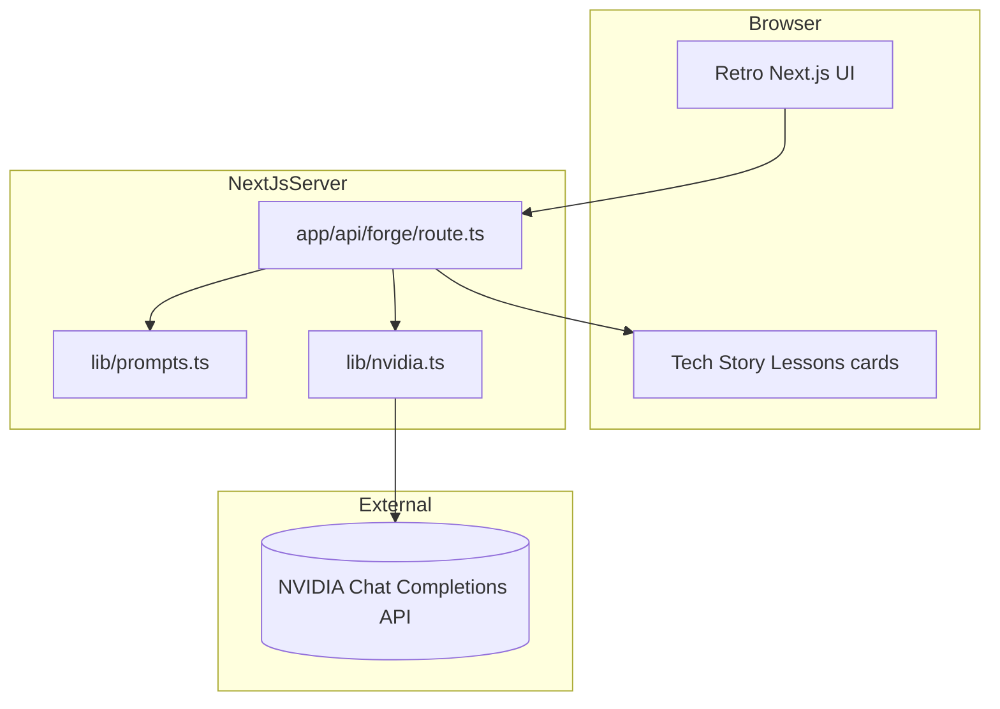

# FLEX-O-MATIC 5000

I built this so I can paste project notes and get three usable LinkedIn posts fast:

- Technical
- Story
- Lessons

Live site: https://syllabuscal.ranjansharma.info.np

## Recommended repository details

- Description: Turn project notes into 3 human sounding LinkedIn posts
- Website: https://syllabuscal.ranjansharma.info.np
- Topics: nextjs react typescript linkedin-post-generator nvidia-api vercel ai-writing

## What it looks like


## Product flow


## System diagram



## Repo structure

```text
.
├── app/
│   ├── api/forge/route.ts
│   ├── components/FlexOMatic.tsx
│   ├── layout.tsx
│   └── page.tsx
├── lib/
│   ├── nvidia.ts
│   ├── prompts.ts
│   └── site-url.ts
├── public/
├── .env.example
├── package.json
└── README.md
```

## Local setup

```bash
cp .env.example .env.local
# add NVIDIA_API_KEY in .env.local
npm install
npm run dev
```

Open http://127.0.0.1:3000

## Deploy notes

For Vercel:

1. Keep Root Directory empty
2. Set `NVIDIA_API_KEY`
3. Set `NEXT_PUBLIC_SITE_URL` to your deployed URL
4. Deploy

## Security notes

- API key stays server side
- `/api/forge` checks origin when provided
- Request size and input length are capped
- Upstream API host is restricted to trusted suffixes

## Scripts

- `npm run dev`
- `npm run lint`
- `npm run build`
- `npm run start`
- `npm run audit`
